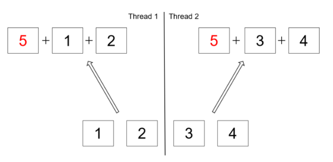

# Parallel Streams in Java

> This is a tutorial course covering parallel streams in Java.

Tools used:

- JDK 11
- Maven
- JUnit 5, Mockito
- IntelliJ IDE

## Table of contents

1. [Introduction to Parallel Streams](https://github.com/backstreetbrogrammer/35_ParallelStreams#chapter-01-introduction-to-parallel-streams)
    - [Interview Problem 1 (Point72 Hedge Fund): How to count huge number of transactions in a trading day](https://github.com/backstreetbrogrammer/35_ParallelStreams#interview-problem-1-point72-hedge-fund-how-to-count-huge-number-of-transactions-in-a-trading-day)
    - [Difference in `parallelStream()` and `stream().parallel()`](https://github.com/backstreetbrogrammer/35_ParallelStreams#difference-in-parallelstream-and-streamparallel)
    - [Performance benchmarking using JMH](https://github.com/backstreetbrogrammer/35_ParallelStreams#performance-benchmarking-using-jmh)
2. [Performance Gains using Parallel Streams](https://github.com/backstreetbrogrammer/35_ParallelStreams#chapter-02-performance-gains-using-parallel-streams)
    - [Autoboxing](https://github.com/backstreetbrogrammer/35_ParallelStreams#autoboxing)
    - [Pointer chasing](https://github.com/backstreetbrogrammer/35_ParallelStreams#pointer-chasing)
3. [Fork-Join Pool of Parallel Streams](https://github.com/backstreetbrogrammer/35_ParallelStreams#chapter-03-fork-join-pool-of-parallel-streams)
    - [Interview Problem 2 (JP Morgan Chase): Identify the issue in the given code snippet](https://github.com/backstreetbrogrammer/35_ParallelStreams#interview-problem-2-jp-morgan-chase-identify-the-issue-in-the-given-code-snippet)
    - [Performance implications](https://github.com/backstreetbrogrammer/35_ParallelStreams#performance-implications)
        - [Hidden synchronizations](https://github.com/backstreetbrogrammer/35_ParallelStreams#hidden-synchronizations)
        - [Faulty non-associative reductions](https://github.com/backstreetbrogrammer/35_ParallelStreams#faulty-non-associative-reductions)
    - [Interview Problem 3 (Barclays): Display the threads executing in parallel streams](https://github.com/backstreetbrogrammer/35_ParallelStreams#interview-problem-3-barclays-display-the-threads-executing-in-parallel-streams)
        - [Follow up 1: Execute a parallel stream in a custom Fork-Join Pool](https://github.com/backstreetbrogrammer/35_ParallelStreams#follow-up-1-execute-a-parallel-stream-in-a-custom-fork-join-pool)
        - [Follow up 2: Count the number of tasks each thread executed in the custom Fork-Join Pool](https://github.com/backstreetbrogrammer/35_ParallelStreams#follow-up-2-count-the-number-of-tasks-each-thread-executed-in-the-custom-fork-join-pool)
    - [Parallel Collectors](https://github.com/backstreetbrogrammer/35_ParallelStreams#parallel-collectors)
4. [Good practices using Parallel Streams](https://github.com/backstreetbrogrammer/35_ParallelStreams#chapter-04-good-practices-using-parallel-streams)
    - [Splitting the data source](https://github.com/backstreetbrogrammer/35_ParallelStreams#splitting-the-data-source)
    - [Merging the results](https://github.com/backstreetbrogrammer/35_ParallelStreams#merging-the-results)
    - [Memory Locality](https://github.com/backstreetbrogrammer/35_ParallelStreams#memory-locality)
    - [When to use parallel streams](https://github.com/backstreetbrogrammer/35_ParallelStreams#when-to-use-parallel-streams)

---

## Chapter 01. Introduction to Parallel Streams

**Java 8** introduced the `Stream` API that makes it easy to iterate over collections as streams of data.

A `Stream` is simply a **wrapper** around a data source, allowing us to perform bulk operations on the data in a
convenient way.

It does **NOT** store data or make any changes to the underlying data source. Rather, it adds support for
**functional-style** operations on data pipelines.

By default, any stream operation is processed **sequentially**, unless explicitly specified as parallel.

Sequential streams use a **single thread** to process the pipeline.

**Example**

**Sequential Stream**

```
    final List<Student> students = List.of(...);
    double average = students.stream()
                       .mapToInt(Student::getAge)
                       .filter(age -> age > 20)
                       .average()
                       .orElseThrow(); // Java 11
```

It's also straightforward to create streams that execute in **parallel** and make use of multiple processor cores.

Converting it into **parallel** stream is elementary.

**Java 8** introduced the `parallelStream()` method to the `Collection` interface and the `parallel()` method to the
`BaseStream` interface.

We can convert the stream to a parallel stream in two ways:

- `Collections.parallelStream()`
- `BaseStream.parallel()`

**Parallel Stream**

```
    final List<Student> students = List.of(...);
    double average = students.stream()
                       .mapToInt(Student::getAge)
                       .filter(age -> age > 20)
                       .parallel() // parallel
                       .average()
                       .orElseThrow();
```

**OR**

```
    final List<Student> students = List.of(...);
    double average = students.parallelStream() // parallel
                       .mapToInt(Student::getAge)
                       .filter(age -> age > 20)
                       .average()
                       .orElseThrow();
```

When a stream executes in **parallel**, the Java runtime splits the stream into multiple sub-streams.

There is a **special** bit which is `set` => any `Stream` **terminal** operation triggers all the **intermediate**
operations. JVM checks for this special bit, and if it is set, then it executes all the operations in parallel.

Parallel streams enable us to execute code in parallel on separate cores. The final result is the combination of each
outcome.

However, the _**order**_ of execution is out of our control. It may change every time we run the program.

We might think that it's always faster to divide the work on more cores. But that is often not the case.

We need to use the parallel streams in **_right way_**, otherwise it will cause more harm than benefits.

We need to learn:

- how data is processed in parallel stream
- how the data is split and joined
- what can affect performance and how to detect bottlenecks
- how to choose our source of data

### Interview Problem 1 (Point72 Hedge Fund): How to count huge number of transactions in a trading day

In the day-to-day trading systems in hedge funds, millions of orders and trades are done on a trading day. Provide a
mechanism to efficiently count all the orders and trades done with **quantity** greater than `1000` (say) in a day.

**Solution**

Suppose the `Order` class looks like this:

```
public class Order {

    private int orderId;
    private String symbol;
    private double price;
    private int quantity;
    private String side;

    //constructor, getters and setters
}
```

If we just want to use default **sequential** streams:

```
    final long usingCollectionsSequential(final Collection<Order> orders, final int qty) {
        final AtomicLong bigOrders = new AtomicLong();
        orders.forEach(order -> {               // default is sequential stream
            if (order.getQuantity() >= qty) {
                bigOrders.getAndIncrement();
            }
        });
        return bigOrders.get();
    }
```

However, we can leverage parallel streams here and find the count more efficiently than doing it serially. The **order**
of execution in our example does not impact the final result in any way, making it a perfect candidate for parallel
Stream operation.

```
    final long usingCollectionsParallel(final Collection<Order> orders, final int qty) {
        final AtomicLong bigOrders = new AtomicLong();
        orders.parallelStream()             // using parallel stream
              .forEach(order -> {
                  if (order.getQuantity() >= qty) {
                      bigOrders.getAndIncrement();
                  }
              });
        return bigOrders.get();
    }
```

**Under the hood**

The default implementation of the `parallelStream()` method creates a parallel `Stream` from
the `Collection's` `Spliterator<T>` interface.

The `Spliterator` is an object for traversing and partitioning elements of its source.

A `Spliterator` can partition off some elements of its source using its `trySplit()` method to make it eligible for
possible parallel operations.

The `Spliterator` API, similar to an `Iterator`, allows for the traversal of elements of its source and was designed to
support efficient **parallel** traversal.

The `Collection's` default `Spliterator` will be used in `parallelStream()` invocation.

**Using BaseStream.parallel()**

We can achieve the same result by first converting the collection to a `Stream`.

We can convert the **sequential** stream generated as a result into a **parallel** stream by calling `parallel()` on it.

Once we have a parallel stream, we can find our result in the same way we have done above.

```
    final long usingStreamParallel(final Collection<Order> orders, final int qty) {
        final AtomicLong bigOrders = new AtomicLong();
        orders.stream()
              .parallel()
              .forEach(order -> {
                  if (order.getQuantity() >= qty) {
                      bigOrders.getAndIncrement();
                  }
              });
        return bigOrders.get();
    }
```

The `BaseStream` interface will split the underlying data as much as the source collection's default `Spliterator` will
allow and then use the **_Fork-Join framework_** to convert it into a parallel Stream.

The result of both approaches bears the same result.

### Difference in `parallelStream()` and `stream().parallel()`

`Collections.parallelStream()` uses the source collection's default `Spliterator` to split the data source to enable
parallel execution.

Splitting the data source **_evenly_** is important for enabling correct parallel execution.

An unevenly split data source does more harm in parallel execution than its sequential counterpart.

A developer can always override `Spliterator` interface and implement its `trySplit()` method incorrectly => not
splitting the data source **_evenly_**.

However, there is no way to override `stream().parallel()` implementation which always tries to return a parallel
version of the stream provided to it.

### Performance benchmarking using JMH

To check whether converting a sequential stream to parallel stream will improve performance or not, it is always
advisable to **measure** the performance.

JMH can be used to do **micro-benchmarking** => it means we can measure the performance of individual **methods** in a
class.

We should include maven dependencies: `jmh-core`, `jmh-generator-annprocess` and include the plugin:
`maven-shade-plugin` in `pom.xml`.

We will use the example method `probablePrime()` as it is a very heavy load CPU computation for all our JMH tests:

```
BigInteger.probablePrime(int bitLength, Random rnd)
// Returns a positive BigInteger that is probably prime, with the specified bitLength.
```

Code snippet:

```
    BigInteger probablePrime(int BIT_LENGTH) {
        return BigInteger.probablePrime(BIT_LENGTH,
                                        ThreadLocalRandom.current());
    }
```

`BIT_LENGTH` tunes the size of the prime number.

The `random` values generator provides **seeds** to generate the prime number.

Suppose we want to create list of probable prime numbers.

```
        final List<BigInteger> primes = new ArrayList<>();
        for (int i = 0; i < N; i++) {
            primes.add(probablePrime(BIT_LENGTH));
        }
```

Doing the same using **sequential** streams:

```
        List<BigInteger> primes =
                IntStream.range(0, N)
                         .limit(N)
                         .mapToObj(i -> probablePrime(BIT_LENGTH))
                         .collect(Collectors.toList());
```

Using **parallel** streams:

```
        List<BigInteger> primes =
                IntStream.range(0, N)
                         .parallel()
                         .mapToObj(i -> probablePrime(BIT_LENGTH))
                         .collect(Collectors.toList());
```

Complete benchmark test class:

```java
import org.openjdk.jmh.annotations.*;
import org.openjdk.jmh.runner.Runner;
import org.openjdk.jmh.runner.RunnerException;
import org.openjdk.jmh.runner.options.Options;
import org.openjdk.jmh.runner.options.OptionsBuilder;

import java.math.BigInteger;
import java.util.ArrayList;
import java.util.List;
import java.util.concurrent.ThreadLocalRandom;
import java.util.concurrent.TimeUnit;
import java.util.stream.IntStream;
import java.util.stream.Stream;

import static java.util.stream.Collectors.toList;

@Warmup(iterations = 10, time = 5, timeUnit = TimeUnit.SECONDS)
@Measurement(iterations = 5, time = 5, timeUnit = TimeUnit.SECONDS)
@Fork(value = 3)
@BenchmarkMode(Mode.AverageTime)
@OutputTimeUnit(TimeUnit.MILLISECONDS)
@State(Scope.Benchmark)
public class ProbablePrimeBenchmarking {
    @Param({"10", "100"})
    private int N;

    @Param({"64", "128"})
    private int BIT_LENGTH;

    BigInteger probablePrime() {
        return BigInteger.probablePrime(BIT_LENGTH,
                                        ThreadLocalRandom.current());
    }

    @Benchmark
    public List<BigInteger> sum_of_N_Primes() {
        final List<BigInteger> pps = new ArrayList<>();
        for (int i = 0; i < N; i++) {
            final BigInteger pp = BigInteger.probablePrime(BIT_LENGTH,
                                                           ThreadLocalRandom.current());
            pps.add(pp);
        }
        return pps;
    }

    @Benchmark
    public List<BigInteger> sum_of_N_Primes_no_resize() {
        final List<BigInteger> pps = new ArrayList<>(N);
        for (int i = 0; i < N; i++) {
            final BigInteger pp = BigInteger.probablePrime(BIT_LENGTH,
                                                           ThreadLocalRandom.current());
            pps.add(pp);
        }
        return pps;
    }

    @Benchmark
    public List<BigInteger> generate_N_primes() {
        return IntStream.range(0, N)
                        .mapToObj(i -> probablePrime())
                        .collect(toList());
    }

    @Benchmark
    public List<BigInteger> generate_N_primes_limit() {
        return Stream.generate(() -> probablePrime())
                     .limit(N)
                     .collect(toList());
    }

    @Benchmark
    public List<BigInteger> generate_N_primes_parallel() {
        return IntStream.range(0, N)
                        .parallel()
                        .mapToObj(i -> probablePrime())
                        .collect(toList());
    }

    @Benchmark
    public List<BigInteger> generate_N_primes_parallel_limit() {
        return Stream.generate(() -> probablePrime())
                     .parallel()
                     .limit(N)
                     .collect(toList());
    }

    @Benchmark
    public List<BigInteger> generate_N_primes_parallel_unordered() {
        return IntStream.range(0, N)
                        .unordered()
                        .parallel()
                        .mapToObj(i -> probablePrime())
                        .collect(toList());
    }

    public static void main(final String[] args) throws RunnerException {
        final Options opt = new OptionsBuilder()
                .include(ProbablePrimeBenchmarking.class.getName())
                .build();
        new Runner(opt).run();
    }

}
```

To run the benchmark test:

- go to the terminal or command prompt
- run `mvn clean install` => this will create `target\benchmarks.jar`
- run the JMH tests => `java -jar target\benchmarks.jar`

**Output**

```
Benchmark                                                       (BIT_LENGTH)  (N)  Mode  Cnt   Score   Error  Units
ProbablePrimeBenchmarking.sum_of_N_Primes                                 64   10  avgt   15   2.674 ± 0.217  ms/op
ProbablePrimeBenchmarking.sum_of_N_Primes                                 64  100  avgt   15  29.664 ± 8.653  ms/op
ProbablePrimeBenchmarking.sum_of_N_Primes                                128   10  avgt   15   7.581 ± 0.406  ms/op
ProbablePrimeBenchmarking.sum_of_N_Primes                                128  100  avgt   15  66.992 ± 6.050  ms/op
ProbablePrimeBenchmarking.sum_of_N_Primes_no_resize                       64   10  avgt   15   2.402 ± 0.216  ms/op
ProbablePrimeBenchmarking.sum_of_N_Primes_no_resize                       64  100  avgt   15  27.921 ± 5.307  ms/op
ProbablePrimeBenchmarking.sum_of_N_Primes_no_resize                      128   10  avgt   15   7.382 ± 0.150  ms/op
ProbablePrimeBenchmarking.sum_of_N_Primes_no_resize                      128  100  avgt   15  75.847 ± 5.966  ms/op

ProbablePrimeBenchmarking.generate_N_primes                               64   10  avgt   15   2.249 ± 0.072  ms/op
ProbablePrimeBenchmarking.generate_N_primes                               64  100  avgt   15  22.502 ± 1.242  ms/op
ProbablePrimeBenchmarking.generate_N_primes                              128   10  avgt   15   7.740 ± 1.235  ms/op
ProbablePrimeBenchmarking.generate_N_primes                              128  100  avgt   15  71.972 ± 5.984  ms/op
ProbablePrimeBenchmarking.generate_N_primes_limit                         64   10  avgt   15   2.417 ± 0.270  ms/op
ProbablePrimeBenchmarking.generate_N_primes_limit                         64  100  avgt   15  24.296 ± 3.817  ms/op
ProbablePrimeBenchmarking.generate_N_primes_limit                        128   10  avgt   15   6.534 ± 0.337  ms/op
ProbablePrimeBenchmarking.generate_N_primes_limit                        128  100  avgt   15  78.284 ± 2.517  ms/op

ProbablePrimeBenchmarking.generate_N_primes_parallel                      64   10  avgt   15   1.371 ± 0.018  ms/op
ProbablePrimeBenchmarking.generate_N_primes_parallel                      64  100  avgt   15  12.679 ± 1.257  ms/op
ProbablePrimeBenchmarking.generate_N_primes_parallel                     128   10  avgt   15   3.555 ± 0.077  ms/op
ProbablePrimeBenchmarking.generate_N_primes_parallel                     128  100  avgt   15  31.999 ± 0.480  ms/op
ProbablePrimeBenchmarking.generate_N_primes_parallel_limit                64   10  avgt   15   1.724 ± 0.032  ms/op
ProbablePrimeBenchmarking.generate_N_primes_parallel_limit                64  100  avgt   15  16.722 ± 0.301  ms/op
ProbablePrimeBenchmarking.generate_N_primes_parallel_limit               128   10  avgt   15   4.679 ± 0.495  ms/op
ProbablePrimeBenchmarking.generate_N_primes_parallel_limit               128  100  avgt   15  54.409 ± 9.498  ms/op
ProbablePrimeBenchmarking.generate_N_primes_parallel_unordered            64   10  avgt   15   1.601 ± 0.171  ms/op
ProbablePrimeBenchmarking.generate_N_primes_parallel_unordered            64  100  avgt   15  15.237 ± 1.560  ms/op
ProbablePrimeBenchmarking.generate_N_primes_parallel_unordered           128   10  avgt   15   3.884 ± 0.574  ms/op
ProbablePrimeBenchmarking.generate_N_primes_parallel_unordered           128  100  avgt   15  30.179 ± 0.278  ms/op
```

As evident from the output, parallel streams performance is much better than sequential streams and for loops.

---

## Chapter 02. Performance Gains using Parallel Streams

While using parallel streams, there are two features that can affect performance:

- Autoboxing
- Pointer chasing

### Autoboxing

**Boxing** refers to the conversion of a primitive value into an object of the corresponding wrapper class. For example,
converting `int` to `Integer` class.

**Unboxing** on the other hand refers to converting an object of a wrapper type to its corresponding primitive value.
For example, conversion of `Integer` to `int`.

Java can box and unbox automatically and this is called **Autoboxing**.

```
int i = 5;
Integer j = 3; // auto-boxing
int k = i + j; // auto-unboxing
Integer l = i + j; // auto-unboxing then auto-boxing
Integer m = j + l; // auto-unboxing then auto-boxing

int[] ints = {1, 2, 3}; // array of int
Integer[] integers = {1, 2, 3}; // array of Integer
List<Integer> list = List.of(1, 2, 3);
```

Autoboxing was added to provide support for **Collections framework** and **Generics**. However, it has a **cost**
associated for all the conversions.

Let's measure the performance using JMH.

```java
import org.openjdk.jmh.annotations.*;
import org.openjdk.jmh.runner.Runner;
import org.openjdk.jmh.runner.RunnerException;
import org.openjdk.jmh.runner.options.Options;
import org.openjdk.jmh.runner.options.OptionsBuilder;

import java.util.concurrent.TimeUnit;

@Warmup(iterations = 10, time = 5, timeUnit = TimeUnit.SECONDS)
@Measurement(iterations = 5, time = 5, timeUnit = TimeUnit.SECONDS)
@Fork(value = 3)
@BenchmarkMode(Mode.AverageTime)
@OutputTimeUnit(TimeUnit.MILLISECONDS)
@State(Scope.Benchmark)
public class AutoboxingBenchmarking {

    @Param({"100000"})
    private int N;

    private int[] arrayOfInts;
    private Integer[] arrayOfIntegers;

    @Setup
    public void createArrayOfInts() {
        arrayOfInts = new int[N];
        for (int i = 0; i < N; i++) {
            arrayOfInts[i] = 3 * i;
        }
    }

    @Setup
    public void createArrayOfIntegers() {
        arrayOfIntegers = new Integer[N];
        for (int i = 0; i < N; i++) {
            arrayOfIntegers[i] = 3 * i;
        }
    }

    @Benchmark
    public int calculate_sum_of_ints() {
        int sum = 0;
        for (int i = 0; i < arrayOfInts.length; i++) {
            sum += i * 7;
        }
        return sum;
    }

    @Benchmark
    public int calculate_sum_of_integers() {
        Integer sum = 0;
        for (int i = 0; i < arrayOfIntegers.length; i++) {
            sum += i * 7;
        }
        return sum;
    }

    public static void main(final String[] args) throws RunnerException {
        final Options opt = new OptionsBuilder()
                .include(AutoboxingBenchmarking.class.getName())
                .build();
        new Runner(opt).run();
    }

}
```

Build and install the project using `mvn clean install`

Run the benchmark test:
`java -jar target/benchmarks.jar AutoboxingBenchmarking.calculate_sum_of_ints AutoboxingBenchmarking.calculate_sum_of_integers`

**Output:**

```
Benchmark                                                                  (N)  Mode  Cnt  Score   Error  Units
ch02_performanceGains.AutoboxingBenchmarking.calculate_sum_of_integers  100000  avgt   15  0.337 ± 0.070  ms/op
ch02_performanceGains.AutoboxingBenchmarking.calculate_sum_of_ints      100000  avgt   15  0.037 ± 0.001  ms/op
```

Performance is very poor for wrapper `Integer` sum as compared to primitive `int` sum because of a lot of autoboxing.

### Pointer chasing

As we have seen multicore CPU architecture before where we have different levels of caches present: `L1, L2 and L3`.


The memory is organized in cache-lines and data is transferred line by line between the main memory and the CPU caches.

An array is stored in a contiguous zone of the memory.

So, for an array of primitive **ints**, the data can be fetched very efficiently from memory to CPU caches.

However, for an array of wrapper **Integers**, only the **references** to different `Integer` objects (which are spread
across the heap) are stored.

Thus, to fetch the actual `Integer` objects pointed by these references is not cache-friendly and has got a cost. This
phenomenon is called **pointer chasing**.

Things are still better in `ArrayList<Integer>` as at-least the references are stored contiguously in memory lines.


In a `LinkedList<Integer>`, even the references are scattered over memory, and we need to trace all the nodes from head
to tail to fetch it.


Let's measure the performance of pointer chasing using JMH.

```java
import org.openjdk.jmh.annotations.*;
import org.openjdk.jmh.runner.Runner;
import org.openjdk.jmh.runner.RunnerException;
import org.openjdk.jmh.runner.options.Options;
import org.openjdk.jmh.runner.options.OptionsBuilder;

import java.util.ArrayList;
import java.util.Collections;
import java.util.LinkedList;
import java.util.Random;
import java.util.concurrent.TimeUnit;
import java.util.stream.Collectors;
import java.util.stream.IntStream;

@Warmup(iterations = 10, time = 5, timeUnit = TimeUnit.SECONDS)
@Measurement(iterations = 5, time = 5, timeUnit = TimeUnit.SECONDS)
@Fork(value = 3)
@BenchmarkMode(Mode.AverageTime)
@OutputTimeUnit(TimeUnit.MILLISECONDS)
@State(Scope.Benchmark)
public class PointerChasingBenchmarking {

    @Param({"100000"})
    private int N;

    private ArrayList<Integer> arrayList = new ArrayList<>();
    private LinkedList<Integer> linkedList = new LinkedList<>();
    private LinkedList<Integer> shuffledLinkedList = new LinkedList<>();
    private LinkedList<Integer> scatteredLinkedList = new LinkedList<>();

    @Setup
    public void createArrayList() {
        arrayList = IntStream.range(0, N)
                             .map(i -> i * 3)
                             .boxed()
                             .collect(Collectors.toCollection(ArrayList::new));
    }

    @Setup
    public void createLinkedList() {
        linkedList = IntStream.range(0, N)
                              .map(i -> i * 3)
                              .boxed()
                              .collect(Collectors.toCollection(LinkedList::new));
    }

    @Setup
    public void createShuffledLinkedList() {
        shuffledLinkedList = new LinkedList<>();
        for (int i = 1; i < N + 1; i++) {
            shuffledLinkedList.add(i * 3);
        }
        Collections.shuffle(shuffledLinkedList, new Random(314159L));
    }

    @Setup
    public void createScatteredLinkedList() {
        scatteredLinkedList = new LinkedList<>();
        for (int i = 1; i < N + 1; i++) {
            scatteredLinkedList.add(i * 3);
            for (int j = 0; j < 100; j++) {
                scatteredLinkedList.add(0);
            }
        }
        scatteredLinkedList.removeIf(i -> i == 0);
    }

    @Benchmark
    public int calculate_sum_of_range() {
        return IntStream.range(0, N)
                        .map(i -> i * 3)
                        .map(i -> i * 7)
                        .sum();
    }

    @Benchmark
    public int calculate_sum_of_range_boxed() {
        return IntStream.range(0, N)
                        .boxed()
                        .map(i -> i * 3)
                        .map(i -> i * 7)
                        .reduce(0, Integer::sum);
    }

    @Benchmark
    public int calculate_sum_of_array_list() {
        return arrayList.stream()
                        .mapToInt(i -> i)
                        .map(i -> i * 5)
                        .sum();
    }

    @Benchmark
    public int calculate_sum_of_linked_list() {
        return linkedList.stream()
                         .mapToInt(i -> i)
                         .map(i -> i * 5)
                         .sum();
    }

    @Benchmark
    public int calculate_sum_of_linked_list_shuffled() {
        return shuffledLinkedList.stream()
                                 .mapToInt(i -> i)
                                 .map(i -> i * 5)
                                 .sum();
    }

    @Benchmark
    public int calculate_sum_of_linked_list_scattered() {
        return scatteredLinkedList.stream()
                                  .mapToInt(i -> i)
                                  .map(i -> i * 5)
                                  .sum();
    }

    public static void main(final String[] args) throws RunnerException {
        final Options opt = new OptionsBuilder()
                .include(PointerChasingBenchmarking.class.getName())
                .build();
        new Runner(opt).run();
    }
}
```

Build and install the project using `mvn clean install`

Run the benchmark test:
`java -jar target/benchmarks.jar PointerChasingBenchmarking`

**Output:**

```
Benchmark                                                                                   (N)  Mode  Cnt   Score   Error  Units
ch02_performanceGains.PointerChasingBenchmarking.calculate_sum_of_array_list             100000  avgt   15   1.041 ± 0.590  ms/op
ch02_performanceGains.PointerChasingBenchmarking.calculate_sum_of_range_boxed            100000  avgt   15   1.675 ± 0.378  ms/op
ch02_performanceGains.PointerChasingBenchmarking.calculate_sum_of_range                  100000  avgt   15   2.024 ± 0.256  ms/op
ch02_performanceGains.PointerChasingBenchmarking.calculate_sum_of_linked_list            100000  avgt   15   0.990 ± 0.168  ms/op
ch02_performanceGains.PointerChasingBenchmarking.calculate_sum_of_linked_list_shuffled   100000  avgt   15   4.289 ± 2.091  ms/op
ch02_performanceGains.PointerChasingBenchmarking.calculate_sum_of_linked_list_scattered  100000  avgt   15  10.386 ± 0.741  ms/op
```

Performance wise, it's better to use `ArrayList` than `LinkedList`.

`LinkedList (scattered)` has the worst performance of all.

```
ArrayList > LinkedList > LinkedList (shuffled) > LinkedList (scattered)
```

---

## Chapter 03. Fork-Join Pool of Parallel Streams

Parallel streams are built on the Fork-Join Pool framework:

- a task is split in 2 sub-tasks
- subtasks are sent to a common pool of thread: **Fork-Join Pool**
- the results of each sub-tasks are joined
- and the global result is computed


There are 2 kinds of tasks:

- tasks that have been split
- terminal tasks

Suppose, we compute a **sum** as our task.

```
A1 is sum of more than 2 integers (say 4 integers).
A1 has been split into 2 sub-tasks A2 and A3. -> split task (fork)
Sub-tasks are small enough (only 2 integers to add) -> terminal tasks
Thus, A2 produced the result as 5 and A3 produced the result as 9.
Results are sent to A1. 
A1 combines the result and produced the result as 14 -> A1 is now terminal task (join)
```

All the above **Fork-Join** steps happen in **parallel**. As soon as the tasks are generated, the computation begins.

The tasks are stored in **waiting queues** -> each thread in the common pool has its **_own_** waiting queue.

A non-active thread can steal tasks from another queue => this is **work stealing**. This helps to utilize all the
threads and make them busy.

The common **Fork-Join Pool**:

- is a pool of threads
- created when the JVM is created
- this pool is used for **all** the parallel streams running on a single JVM instance
- the **size** of the pool is **fixed** by the number of **virtual cores**

However, the API allows us to specify the number of threads it will use by passing a JVM parameter:

```
-D java.util.concurrent.ForkJoinPool.common.parallelism=4
```

It's important to remember that this is a global setting and that it will affect all parallel streams and any other
fork-join tasks that use the common pool. Thus, this parameter should not be modified unless we have an excellent reason
for doing so.

### Interview Problem 2 (JP Morgan Chase): Identify the issue in the given code snippet

The fork-join framework is in charge of splitting the source data between worker threads and handling callback on task
completion.

Code snippet for calculating a sum of integers in parallel:

```java
import org.junit.jupiter.api.Test;

import java.util.List;

import static org.junit.jupiter.api.Assertions.assertEquals;

public class ParallelStreamsIssues {

    @Test
    void testParallelSumOfIntegers() {
        final List<Integer> listOfNumbers = List.of(1, 2, 3, 4);
        final int sum = listOfNumbers.parallelStream()
                                     .reduce(5, Integer::sum);
        assertEquals(15, sum);
    }
}
```

**Output**

```
org.opentest4j.AssertionFailedError: 
Expected :15
Actual   :30
<Click to see difference>

	at org.junit.jupiter.api.AssertionFailureBuilder.build(AssertionFailureBuilder.java:151)
	...
	at org.junit.jupiter.api.AssertEquals.assertEquals(AssertEquals.java:145)
	at org.junit.jupiter.api.Assertions.assertEquals(Assertions.java:528)
	at com.backstreetbrogrammer.ch03_forkJoin.ParallelStreamsIssues.testParallelSumOfIntegers(ParallelStreamsIssues.java:16)
	...
	...
```

Sum of first `5` integers `1...5` is `15`.

However, the above test always **fails**!

If we use **sequential** stream, `sum` is always correct as `15`.

But since the `reduce()` operation is handled in **parallel**, the number `5` actually gets added up in **every** worker
thread:



The actual result might differ depending on the number of threads used in the common fork-join pool.

For example, when we run this test case in computer with 4 virtual cores, then 5 is added to each split of data.

```
[1,2,3,4]

T1 = 5 + 1
T2 = 5 + 2
T3 = 5 + 3
T4 = 5 + 4

Total = 6 + 7 + 8 + 9 = 30
```

**Solution**

Number `5` should be added outside the parallel stream:

```
    @Test
    void testParallelSumOfIntegersCorrect() {
        final List<Integer> listOfNumbers = List.of(1, 2, 3, 4);
        final int sum = listOfNumbers.parallelStream()
                                     .reduce(0, Integer::sum) + 5;
        assertEquals(15, sum);
    }
```

Therefore, we need to be cautious about which operations can be run in parallel.

Besides, the default **common** thread pool, it's also possible to run a parallel stream in a **custom** thread pool.

```
    @Test
    void testCustomThreadPool() throws ExecutionException, InterruptedException {
        final List<Integer> listOfNumbers = List.of(1, 2, 3, 4, 5);
        final ForkJoinPool customThreadPool = new ForkJoinPool(4);
        final int sum = customThreadPool
                .submit(
                        () -> listOfNumbers.parallelStream()
                                           .reduce(0, Integer::sum))
                .get();
        customThreadPool.shutdown();
        assertEquals(15, sum);
    }
```

However, please note that using the **common** thread pool is recommended by **Oracle**.

We should have a perfect reason for running parallel streams in **custom** thread pools.

### Performance implications

Parallel processing may be beneficial to fully utilize multiple cores. But we also need to consider the overhead of
managing multiple threads, memory locality, splitting the source and merging the results.

Let's consider a simple example to sum a list of integers serially and in parallel.

```java
import org.openjdk.jmh.annotations.*;
import org.openjdk.jmh.runner.Runner;
import org.openjdk.jmh.runner.RunnerException;
import org.openjdk.jmh.runner.options.Options;
import org.openjdk.jmh.runner.options.OptionsBuilder;

import java.util.List;
import java.util.Random;
import java.util.concurrent.ThreadLocalRandom;
import java.util.concurrent.TimeUnit;
import java.util.stream.Collectors;
import java.util.stream.IntStream;

@Warmup(iterations = 10, time = 1, timeUnit = TimeUnit.SECONDS)
@Measurement(iterations = 5, time = 1, timeUnit = TimeUnit.SECONDS)
@Fork(value = 3)
@BenchmarkMode(Mode.AverageTime)
@OutputTimeUnit(TimeUnit.MICROSECONDS)
@State(Scope.Benchmark)
public class ParallelSumBenchmarking {

    private final Random random = ThreadLocalRandom.current();

    @Param({"10000000"})
    private int N;
    private List<Integer> intsN100;

    @Setup
    public void setup() {
        intsN100 = IntStream.range(0, N)
                            .mapToObj(index -> random.nextInt(100))
                            .collect(Collectors.toList());
    }

    @Benchmark
    public double sum_no_parallel() {
        return intsN100.stream().mapToInt(i -> i).sum();
    }

    @Benchmark
    public double sum_parallel() {
        return intsN100.stream().mapToInt(i -> i).parallel().sum();
    }

    public static void main(final String[] args) throws RunnerException {
        final Options opt = new OptionsBuilder()
                .include(ParallelSumBenchmarking.class.getName())
                .build();
        new Runner(opt).run();
    }
}
```

When `N` is very huge = `10_000_000`, **parallel** sum will result in much **better** performance.

```
Benchmark                                                   (N)  Mode  Cnt      Score     Error  Units
ch03_forkJoin.ParallelSumBenchmarking.sum_no_parallel  10000000  avgt   15  12897.447 ± 768.043  us/op
ch03_forkJoin.ParallelSumBenchmarking.sum_parallel     10000000  avgt   15   5613.219 ± 560.596  us/op
```

However, if we reduce `N` to `10` or `100`, **parallel** sum will have much **worse** performance.

```
    @Param({"10"})
    private int N;
```

```
Benchmark                                              (N)  Mode  Cnt   Score    Error  Units
ch03_forkJoin.ParallelSumBenchmarking.sum_no_parallel   10  avgt   15   0.169 ±  0.079  us/op
ch03_forkJoin.ParallelSumBenchmarking.sum_parallel      10  avgt   15  25.582 ± 27.177  us/op
```

The reason behind this is that sometimes the overhead of managing threads, sources and results is a more expensive
operation than doing the actual work.

Things that can go wrong:

- Hidden synchronizations
- Faulty non-associative reductions

#### Hidden synchronizations

Synchronization means allowing only 1 thread to access a piece of critical code or critical section.

Code snippet:

```
stream.filter(number -> number % 11 == 0)
      .findFirst(); // find the FIRST element
```

How can Fork-Join API track the first element? By using synchronization across multiple threads in the pool.

However, using `findAny()` will be much easier and have less or no hidden synchronization involved.

Similarly, for `limit()`, there is hidden synchronization involved:

```
stream.limit(100) // takes the FIRST 100 elements
      .sum(); 
```

Benchmarking tests for `limit()` costs:

```java
import org.openjdk.jmh.annotations.*;
import org.openjdk.jmh.runner.Runner;
import org.openjdk.jmh.runner.RunnerException;
import org.openjdk.jmh.runner.options.Options;
import org.openjdk.jmh.runner.options.OptionsBuilder;

import java.util.List;
import java.util.Random;
import java.util.concurrent.ThreadLocalRandom;
import java.util.concurrent.TimeUnit;
import java.util.stream.Collectors;
import java.util.stream.IntStream;

@Warmup(iterations = 10, time = 1, timeUnit = TimeUnit.SECONDS)
@Measurement(iterations = 5, time = 1, timeUnit = TimeUnit.SECONDS)
@Fork(value = 3)
@BenchmarkMode(Mode.AverageTime)
@OutputTimeUnit(TimeUnit.MICROSECONDS)
@State(Scope.Benchmark)
public class ParallelSumLimitBenchmarking {

    private final Random random = ThreadLocalRandom.current();

    @Param({"1000000"})
    private int N;
    private List<Integer> intsN100;
    private List<Integer> intsN150;

    @Setup
    public void setup() {
        intsN100 = IntStream.range(0, N)
                            .mapToObj(index -> random.nextInt(100))
                            .collect(Collectors.toList());

        intsN150 = IntStream.range(0, N + N / 2)
                            .mapToObj(index -> random.nextInt(100))
                            .collect(Collectors.toList());
    }

    @Benchmark
    public double sum_no_parallel() {
        return intsN100.stream().mapToInt(i -> i).sum();
    }

    @Benchmark
    public double sum_limit_no_parallel() {
        return intsN150.stream().mapToInt(i -> i).limit(N).sum();
    }

    @Benchmark
    public double sum_parallel() {
        return intsN100.stream().mapToInt(i -> i).parallel().sum();
    }

    @Benchmark
    public double sum_limit_parallel() {
        return intsN150.stream().mapToInt(i -> i).parallel().limit(N).sum();
    }

    public static void main(final String[] args) throws RunnerException {
        final Options opt = new OptionsBuilder()
                .include(ParallelSumLimitBenchmarking.class.getName())
                .build();
        new Runner(opt).run();
    }

}
```

**Output:**

```
Benchmark                                                             (N)  Mode  Cnt     Score     Error  Units
ch03_forkJoin.ParallelSumLimitBenchmarking.sum_no_parallel        1000000  avgt   15   990.050 ± 106.966  us/op
ch03_forkJoin.ParallelSumLimitBenchmarking.sum_limit_no_parallel  1000000  avgt   15  3163.945 ± 551.432  us/op
ch03_forkJoin.ParallelSumLimitBenchmarking.sum_parallel           1000000  avgt   15   855.696 ± 455.627  us/op
ch03_forkJoin.ParallelSumLimitBenchmarking.sum_limit_parallel     1000000  avgt   15  2392.454 ± 940.209  us/op
```

As per the results, we can see that using `limit()` in **serial** streams or **parallel** streams has got a lot of
overhead cost because of **hidden synchronization**.

#### Faulty non-associative reductions

If we are using the `reduce()` method to reduce the stream OR to **join** the partial results => then the operation has
to be **associative**.

In mathematics, an **associative** operation is a calculation that gives the same result regardless of the way the
numbers are grouped. **Addition** and **multiplication** are both associative, while **subtraction** and **division**
are not.

For example, addition is associative:

```
Associative 

2+(2+5) = 9
(2+2)+5 = 9
```

While, subtraction is not associative:

```
Not associative 

4-(2-1) = 3
(4-2)-1 = 1
```

Now, let's take the example of `reduce()`:

```
BinaryOperator<T> reduction = ...;

// if using parallel streams, data can be split in random order 
// say, first as (a,b) and c 
T t1 = reduction.apply(a, b);
T result = reduction.apply(t1, c);

// OR, first as (b,c) and a 
T t2 = reduction.apply(b, c);
T result = reduction.apply(t2, a);

// OR, first as (a,c) and b
T t3 = reduction.apply(a, c);
T result = reduction.apply(t3, b);
```

Thus, it all depends on this `BinaryOperator<T> reduction` whether it is associative or not, otherwise, we will get
wrong results.

For example, if we are using **sum** (`T::sum`), then the result will be correct using parallel streams, irrespective of
how the data is being split among threads.

Using **identity** with `reduce()` method for sum will be associative:

```
stream.reduce(0, (a, b) -> a + b));
```

However, the sum of squares code snippet is **not** associative:

```
stream.reduce(0, (a, b) -> a*a + b*b));
```

If we have a list of `8` integers = `[1, 1, 1, 1, 1, 1, 1, 1]`

Expected correct result is = `1*1 + 1*1 + 1*1 + 1*1 + 1*1 + 1*1 + 1*1 + 1*1 => 8`

However, if we use parallel stream `reduce()` method as above:

```
T1 gets first 2 ones = 1*1 + 1*1 => 2
After that, it gets the third 1 = 2*2 + 1*1 => 5
After that, it gets the fourth 1 = 5*5 + 1*1 => 26
...
```

In another scenario, if all the `8` integers are split uniformly in Fork-Join pool, results will still be wrong.

```
[1, 1, 1, 1, 1, 1, 1, 1] => split into 2 subtasks [1, 1, 1, 1] and  [1, 1, 1, 1]
Again, each subtaks [1, 1, 1, 1] are split into 2 subtasks [1, 1] and [1, 1]
Now sum is calculated as we have reached terminal tasks [1, 1] = 1*1 + 1*1 = 2
Results of 2 subtasks = [1, 1] and [1, 1] = 2*2 + 2*2 = 8
Results of 2 subtasks = [1, 1, 1, 1] and  [1, 1, 1, 1] = 8*8 + 8*8 = 128
```

Associativity unit test:

```
    @Test
    void testAssociativityIssues() {
        final int sum = IntStream.range(0, 10)
                                 .sum();
        System.out.printf("sum = %d%n", sum);

        final int sumParallel = IntStream.range(0, 10)
                                         .parallel()
                                         .sum();
        System.out.printf("parallel sum = %d%n", sumParallel);

        final int sumOfSquares = IntStream.range(0, 10)
                                          .reduce(0, (i1, i2) -> i1 * i1 + i2 * i2);
        System.out.printf("sum of squares = %d%n", sumOfSquares);

        final int sumOfSquaresParallel = IntStream.range(0, 10)
                                                  .map(i -> i * i)
                                                  .parallel()
                                                  .reduce(0, (i1, i2) -> i1 * i1 + i2 * i2);
        System.out.printf("parallel sum of squares = %d%n", sumOfSquaresParallel);
    }
```

**Output**

```
sum = 45
parallel sum = 45
sum of squares = 492125537
parallel sum of squares = 1972450717
```

### Interview Problem 3 (Barclays): Display the threads executing in parallel streams

Write a demo code to display the threads' names executed in parallel streams.

**Solution**

As we have learnt that parallel streams use common Fork-Join pool under the hood, we should be able to explain the same.

```
    @Test
    @DisplayName("Display thread names in parallel stream")
    void displayThreadNamesInParallelStream() {
        final Set<String> threadNames = ConcurrentHashMap.newKeySet();

        final int sum = IntStream.range(0, 1_000_000)
                                 .map(i -> i * 3)
                                 .parallel()
                                 .peek(i -> threadNames.add(Thread.currentThread().getName()))
                                 .sum();

        threadNames.forEach(System.out::println);
    }
```

**Sample Output**

```
ForkJoinPool.commonPool-worker-7
main
ForkJoinPool.commonPool-worker-5
ForkJoinPool.commonPool-worker-3
```

#### Follow up 1: Execute a parallel stream in a custom Fork-Join Pool

We can create a new `ForkJoinPool` object with the given amount of parallelism and submit the tasks to it.

```
    @Test
    @DisplayName("Execute a parallel stream in a custom Fork-Join Pool")
    void executeParallelStreamInCustomForkJoinPool() throws ExecutionException, InterruptedException {
        final Set<String> threadNames = ConcurrentHashMap.newKeySet();
        final ForkJoinPool forkJoinPool = new ForkJoinPool(4);
        final Callable<Integer> task = () -> IntStream.range(0, 1_000_000)
                                                      .map(i -> i * 3)
                                                      .parallel()
                                                      .peek(i -> threadNames.add(Thread.currentThread().getName()))
                                                      .sum();

        final ForkJoinTask<Integer> submit = forkJoinPool.submit(task);
        submit.get(); // blocking
        
        threadNames.forEach(System.out::println);
        forkJoinPool.shutdown();
    }
```

**Sample Output**

```
ForkJoinPool-1-worker-7
ForkJoinPool-1-worker-1
ForkJoinPool-1-worker-5
ForkJoinPool-1-worker-3
```

#### Follow up 2: Count the number of tasks each thread executed in the custom Fork-Join Pool

This is a tricky question, but it helps to understand the internal details and control of the threads.

```
    @Test
    @DisplayName("Count the number of tasks each thread executed in the custom Fork-Join Pool")
    void countNumberOfTasksExecutedByEachThreadCustomForkJoinPool() throws ExecutionException, InterruptedException {
        final Map<String, Long> threadMap = new ConcurrentHashMap<>();
        final ForkJoinPool forkJoinPool = new ForkJoinPool(4);
        final Callable<Integer> task = () -> IntStream.range(0, 1_000_000)
                                                      .map(i -> i * 3)
                                                      .parallel()
                                                      .peek(i -> threadMap.merge(Thread.currentThread().getName(),
                                                                                 1L, Long::sum))
                                                      .sum();
        final ForkJoinTask<Integer> submit = forkJoinPool.submit(task);
        submit.get(); // blocking

        threadMap.forEach((threadName, count) -> System.out.printf("Thread name: %s, Count of tasks: %d%n",
                                                                   threadName, count));
        forkJoinPool.shutdown();
    }
```

**Sample Output**

```
Thread name: ForkJoinPool-1-worker-7, Count of tasks: 312500
Thread name: ForkJoinPool-1-worker-1, Count of tasks: 125000
Thread name: ForkJoinPool-1-worker-5, Count of tasks: 312500
Thread name: ForkJoinPool-1-worker-3, Count of tasks: 250000
```

### Parallel Collectors

Parallel Streams were one of Java 8's highlights, but they turned out to be applicable to **heavy CPU processing**
exclusively.

The reason for this was the fact that Parallel Streams were internally backed by a **JVM-wide shared** `ForkJoinPool`,
which provided limited parallelism and was used by all Parallel Streams running on a single JVM instance.

It becomes problematic if we start running multiple parallel blocking operations in parallel. This might quickly
saturate the pool and result in potentially huge latencies. That's why it's important to build bulkheads by creating
**separate thread pools** – to prevent unrelated tasks from influencing each other's execution.

There is a third party library that handles Parallel Streams API very well:

[Parallel Collectors](https://github.com/pivovarit/parallel-collectors)

---

## Chapter 04. Good practices using Parallel Streams

A Stream can be created on many sources of data like arrays, collections, text files, etc.

### Splitting the data source

Splitting the data source **evenly** is a necessary cost to enable parallel execution, but some data sources split
better than others.

Suppose we have an array of integers of length `1 million`.

```
int[] arr = new int[1_000_000];
```

It is easy to split an array in `2` sub-arrays of the same size.


The key point here is to choose the source of data for which reaching the center of data must be easy, reliable and
efficient.

Now, let's look at `LinkedList` example.


It is easy to split a `LinkedList` but costly to reach the element at the **center**.

Benchmarking test to compare `ArrayList` with `LinkedList`:

```java
import org.openjdk.jmh.annotations.*;
import org.openjdk.jmh.runner.Runner;
import org.openjdk.jmh.runner.RunnerException;
import org.openjdk.jmh.runner.options.Options;
import org.openjdk.jmh.runner.options.OptionsBuilder;

import java.util.ArrayList;
import java.util.LinkedList;
import java.util.List;
import java.util.concurrent.TimeUnit;
import java.util.stream.IntStream;

@Warmup(iterations = 10, time = 1, timeUnit = TimeUnit.SECONDS)
@Measurement(iterations = 5, time = 1, timeUnit = TimeUnit.SECONDS)
@Fork(value = 3)
@BenchmarkMode(Mode.AverageTime)
@OutputTimeUnit(TimeUnit.MICROSECONDS)
@State(Scope.Benchmark)
public class SplittingDataBenchmarking {

    @Param({"1000000"})
    private int N;

    private final List<Integer> arrayListOfNumbers = new ArrayList<>();
    private final List<Integer> linkedListOfNumbers = new LinkedList<>();

    @Setup
    public void setup() {
        IntStream.rangeClosed(1, N).forEach(i -> {
            arrayListOfNumbers.add(i);
            linkedListOfNumbers.add(i);
        });
    }

    @Benchmark
    public double sum_arrayList_sequential() {
        return arrayListOfNumbers.stream().reduce(0, Integer::sum);
    }

    @Benchmark
    public double sum_arrayList_parallel() {
        return arrayListOfNumbers.parallelStream().reduce(0, Integer::sum);
    }

    @Benchmark
    public double sum_linkedList_sequential() {
        return linkedListOfNumbers.stream().reduce(0, Integer::sum);
    }

    @Benchmark
    public double sum_linkedList_parallel() {
        return linkedListOfNumbers.parallelStream().reduce(0, Integer::sum);
    }

    public static void main(final String[] args) throws RunnerException {
        final Options opt = new OptionsBuilder()
                .include(SplittingDataBenchmarking.class.getName())
                .build();
        new Runner(opt).run();
    }
}
```

**Output**

```
Benchmark                                                                   (N)  Mode  Cnt      Score      Error  Units
ch04_bestPractices.SplittingDataBenchmarking.sum_arrayList_parallel     1000000  avgt   15   2955.049 ±   40.215  us/op
ch04_bestPractices.SplittingDataBenchmarking.sum_arrayList_sequential   1000000  avgt   15   8057.878 ± 3829.862  us/op
ch04_bestPractices.SplittingDataBenchmarking.sum_linkedList_parallel    1000000  avgt   15  16006.547 ± 8762.589  us/op
ch04_bestPractices.SplittingDataBenchmarking.sum_linkedList_sequential  1000000  avgt   15  10401.785 ± 3952.188  us/op
```

Results show that converting a sequential stream into a parallel one brings performance benefits only for `ArrayList`.

The reason behind this is that arrays can **split** cheaply and evenly, while `LinkedList` has none of these properties.

**Set and HashMap**

A `Set` is implemented by `HashSet`, backed by a `HashMap`. And as we know that `HashMap` is built on an **array**.

Size of the backed array is always a power of 2: 16, 32, 64, etc.

The entry object is stored in this array based on the hashcode of the key and randomly split across the array. For the
hash collisions, the same bucket can have linked-list of entry objects.

Therefore, although splitting a set is easy and reaching the center is inexpensive, still it's impossible to know if
both the halves contain equal number of entry objects.

Thus, `HashSet` and `HashMap` split better than `LinkedList` but not as well as **arrays**.

**Iterator**

A **stream** can be created on an **iterator** but the number of elements is **unknown**. So parallel stream split will
be not as performant as `Set`, `Map` or an `array`.

Let's do some JMH benchmarking between `List` and `Set` operations.

```java
import org.openjdk.jmh.annotations.*;
import org.openjdk.jmh.runner.Runner;
import org.openjdk.jmh.runner.RunnerException;
import org.openjdk.jmh.runner.options.Options;
import org.openjdk.jmh.runner.options.OptionsBuilder;

import java.io.IOException;
import java.nio.file.Files;
import java.nio.file.Path;
import java.util.ArrayList;
import java.util.List;
import java.util.Random;
import java.util.Set;
import java.util.concurrent.TimeUnit;
import java.util.stream.Collectors;
import java.util.stream.IntStream;
import java.util.stream.Stream;

@Warmup(iterations = 10, time = 1, timeUnit = TimeUnit.SECONDS)
@Measurement(iterations = 5, time = 1, timeUnit = TimeUnit.SECONDS)
@Fork(value = 3)
@BenchmarkMode(Mode.AverageTime)
@OutputTimeUnit(TimeUnit.MICROSECONDS)
@State(Scope.Benchmark)
public class SourceSplitBenchmarking {

    @Param("10000000")
    int N;

    final Random random = new Random(314L);

    Set<String> lineSet;
    List<String> lineList;
    Set<Integer> intSet;
    List<Integer> intList;

    @Setup
    public void readLines() {
        try (final Stream<String> lines = Files.lines(Path.of("src", "main", "resources", "words.txt"))) {
            this.lineSet = lines.collect(Collectors.toSet());
        } catch (final IOException e) {
            e.printStackTrace();
        }
        this.lineList = new ArrayList<>(this.lineSet);
    }

    @Setup
    public void intsList() {
        intList = IntStream.range(0, N)
                           .map(i -> random.nextInt())
                           .boxed()
                           .collect(Collectors.toList());
    }

    @Setup
    public void intsSet() {
        intSet = IntStream.range(0, N)
                          .map(i -> random.nextInt())
                          .boxed()
                          .collect(Collectors.toSet());
    }

    @Benchmark
    public Object process_string_set() {
        return lineSet.stream()
                      .map(String::toUpperCase)
                      .mapToInt(String::length)
                      .sum();
    }

    @Benchmark
    public Object process_string_list() {
        return lineList.stream()
                       .map(String::toUpperCase)
                       .mapToInt(String::length)
                       .sum();
    }

    @Benchmark
    public Object process_string_list_parallel() {
        return lineList.stream()
                       .map(String::toUpperCase)
                       .mapToInt(String::length)
                       .parallel()
                       .sum();
    }

    @Benchmark
    public Object process_string_set_parallel() {
        return lineSet.stream()
                      .map(String::toUpperCase)
                      .mapToInt(String::length)
                      .parallel()
                      .sum();
    }

    @Benchmark
    public Object process_int_set() {
        return intSet.stream()
                     .mapToInt(i -> i * 3)
                     .sum();
    }

    @Benchmark
    public Object process_int_list() {
        return intList.stream()
                      .mapToInt(i -> i * 3)
                      .sum();
    }

    @Benchmark
    public Object process_int_set_parallel() {
        return intSet.stream()
                     .mapToInt(i -> i * 3)
                     .parallel()
                     .sum();
    }

    @Benchmark
    public Object process_int_list_parallel() {
        return intList.stream()
                      .mapToInt(i -> i * 3)
                      .parallel()
                      .sum();
    }

    public static void main(final String[] args) throws RunnerException {
        final Options opt = new OptionsBuilder()
                .include(SourceSplitBenchmarking.class.getName())
                .build();
        new Runner(opt).run();
    }
}
```

**Output**

```
Benchmark                                                                     (N)  Mode  Cnt       Score       Error  Units
ch04_bestPractices.SourceSplitBenchmarking.process_int_list              10000000  avgt   15   22326.763 ±   779.031  us/op
ch04_bestPractices.SourceSplitBenchmarking.process_int_set               10000000  avgt   15  425023.415 ± 20879.082  us/op

ch04_bestPractices.SourceSplitBenchmarking.process_int_list_parallel     10000000  avgt   15   11685.281 ±   546.109  us/op
ch04_bestPractices.SourceSplitBenchmarking.process_int_set_parallel      10000000  avgt   15  205494.217 ± 16508.364  us/op

ch04_bestPractices.SourceSplitBenchmarking.process_string_list           10000000  avgt   15      68.642 ±     7.889  us/op
ch04_bestPractices.SourceSplitBenchmarking.process_string_set            10000000  avgt   15      72.205 ±     7.225  us/op

ch04_bestPractices.SourceSplitBenchmarking.process_string_list_parallel  10000000  avgt   15      64.792 ±    44.118  us/op
ch04_bestPractices.SourceSplitBenchmarking.process_string_set_parallel   10000000  avgt   15     101.882 ±    12.773  us/op
```

As seen in the benchmark test results, `ArrayList` performs much better than `HashSet`.

### Merging the results

Every time we split the source for parallel computation, we also need to make sure to combine the results in the end.

Let's run a benchmark on a **sequential** and **parallel** stream, with **sum** and **grouping** as different merging
operations:

```java
import org.openjdk.jmh.annotations.*;
import org.openjdk.jmh.runner.Runner;
import org.openjdk.jmh.runner.RunnerException;
import org.openjdk.jmh.runner.options.Options;
import org.openjdk.jmh.runner.options.OptionsBuilder;

import java.util.ArrayList;
import java.util.List;
import java.util.Set;
import java.util.concurrent.TimeUnit;
import java.util.stream.Collectors;
import java.util.stream.IntStream;

@Warmup(iterations = 10, time = 1, timeUnit = TimeUnit.SECONDS)
@Measurement(iterations = 5, time = 1, timeUnit = TimeUnit.SECONDS)
@Fork(value = 3)
@BenchmarkMode(Mode.AverageTime)
@OutputTimeUnit(TimeUnit.MICROSECONDS)
@State(Scope.Benchmark)
public class MergingResultsBenchmarking {

    @Param({"1000000"})
    private int N;

    private final List<Integer> arrayListOfNumbers = new ArrayList<>();

    @Setup
    public void setup() {
        IntStream.rangeClosed(1, N).forEach(arrayListOfNumbers::add);
    }

    @Benchmark
    public double sum_arrayList_sequential() {
        return arrayListOfNumbers.stream().reduce(0, Integer::sum);
    }

    @Benchmark
    public double sum_arrayList_parallel() {
        return arrayListOfNumbers.stream().parallel().reduce(0, Integer::sum);
    }

    @Benchmark
    public Set<Integer> collect_arrayList_sequential() {
        return arrayListOfNumbers.stream().collect(Collectors.toSet());
    }

    @Benchmark
    public Set<Integer> collect_arrayList_parallel() {
        return arrayListOfNumbers.stream().parallel().collect(Collectors.toSet());
    }

    public static void main(final String[] args) throws RunnerException {
        final Options opt = new OptionsBuilder()
                .include(MergingResultsBenchmarking.class.getName())
                .build();
        new Runner(opt).run();
    }
}
```

**Output**

```
Benchmark                                                                       (N)  Mode  Cnt       Score        Error  Units
ch04_bestPractices.MergingResultsBenchmarking.collect_arrayList_parallel    1000000  avgt   15  365329.118 ± 134080.017  us/op
ch04_bestPractices.MergingResultsBenchmarking.collect_arrayList_sequential  1000000  avgt   15  158669.485 ±  26974.341  us/op
ch04_bestPractices.MergingResultsBenchmarking.sum_arrayList_parallel        1000000  avgt   15    4405.790 ±    426.799  us/op
ch04_bestPractices.MergingResultsBenchmarking.sum_arrayList_sequential      1000000  avgt   15    8443.536 ±    945.115  us/op
```

Results show that converting a sequential stream into a parallel one brings performance benefits only for the **sum**
operation.

The merge operation is really economical for some operations, such as **reduction** and **addition**, but merge
operations like **grouping** to **sets** or **maps** can be quite expensive.

### Memory Locality

Modern computers use a sophisticated multilevel cache to keep frequently used data close to the processor. When a linear
memory access pattern is detected, the hardware **prefetches** the next line of data under the assumption that it will
probably be needed soon.

Parallelism brings performance benefits when we can keep the processor cores busy doing useful work. Since waiting for
cache **misses** is not useful work, we need to consider the memory bandwidth as a limiting factor.

An array of primitives brings the best locality possible in Java. In general, the more pointers we have in our data
structure, the more pressure we put on the memory to fetch the reference objects - **pointer chasing**. This can have a
negative effect on parallelization, as multiple cores simultaneously fetch the data from memory.

**NQ Model**

Oracle presented a simple model that can help us determine whether parallelism can offer us a performance boost. In the
`NQ` model, `N` stands for the number of source data elements, while `Q` represents the amount of computation performed
per data element.

The larger the product of `N*Q`, the more likely we are to get a performance boost from parallelization. For problems
with a trivially small `Q`, such as **summing** up numbers, the rule of thumb is that `N` should be greater
than `10,000`. As the number of computations increases, the data size required to get a performance boost from
parallelism decreases.

### When to use parallel streams

As we've seen, we need to be very considerate when using parallel streams.

Parallelism can bring performance benefits in certain use cases. But parallel streams cannot be considered as a magical
performance booster. So, **sequential** streams should still be used as **default** during development.

A **sequential** stream can be converted to a **parallel** one when we have actual performance requirements. Given those
requirements, we should first run a performance measurement and consider parallelism as a possible optimization
strategy.

A large amount of data and many computations done per element indicate that parallelism could be a good option.

On the other hand, a small amount of data, unevenly splitting sources, expensive merge operations and poor memory
locality indicate a potential problem for parallel execution.

- **Arrays** / **ArrayList**  are a great data source for parallel execution because they bring the best possible
  locality (cache-friendly) and can split cheaply and evenly.
- Do NOT go parallel on the wrong source - sources of UNKNOWN size, splitting evenly is difficult, etc. Make sure our
  source is SIZED and SUB-SIZED
- Prefer `Lists` over `Sets`
- Avoid **hidden synchronizations** - `findFirst()`, `limit()`, `skip()` etc.
- Avoid faulty **reductions** - it should be **associative** and **stateless**
- Avoid using **grouping** or **collect** methods
- **File Search** using parallel streams performs better in comparison to sequential streams. For example, searching
  over 1500 text files.

---

